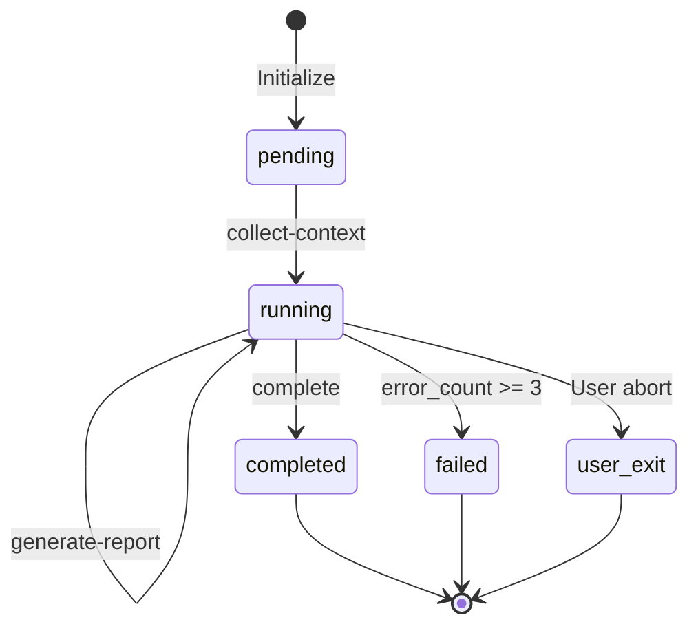

# State Schema

Code Review 状态结构定义。

## Schema Definition

```typescript
interface ReviewState {
  // === 元数据 ===
  status: 'pending' | 'running' | 'completed' | 'failed' | 'user_exit';
  started_at: string;      // ISO timestamp
  updated_at: string;      // ISO timestamp
  completed_at?: string;   // ISO timestamp
  
  // === 审查目标 ===
  context: {
    target_path: string;       // 目标路径（文件或目录）
    files: string[];           // 待审查文件列表
    language: string;          // 主要编程语言
    framework?: string;        // 框架（如有）
    total_lines: number;       // 总代码行数
    file_count: number;        // 文件数量
  };
  
  // === 扫描结果 ===
  scan_completed: boolean;
  scan_summary: {
    risk_areas: RiskArea[];    // 高风险区域
    complexity_score: number;  // 复杂度评分
    quick_issues: QuickIssue[]; // 快速发现的问题
  };
  
  // === 审查进度 ===
  reviewed_dimensions: string[];  // 已完成的审查维度
  current_dimension?: string;     // 当前审查维度
  
  // === 发现的问题 ===
  findings: {
    correctness: Finding[];
    readability: Finding[];
    performance: Finding[];
    security: Finding[];
    testing: Finding[];
    architecture: Finding[];
  };
  
  // === 报告状态 ===
  report_generated: boolean;
  report_path?: string;
  
  // === 执行跟踪 ===
  current_action?: string;
  completed_actions: string[];
  errors: ExecutionError[];
  error_count: number;
  
  // === 统计信息 ===
  summary?: {
    total_issues: number;
    critical: number;
    high: number;
    medium: number;
    low: number;
    info: number;
    review_duration_ms: number;
  };
}

interface RiskArea {
  file: string;
  reason: string;
  priority: 'high' | 'medium' | 'low';
}

interface QuickIssue {
  type: string;
  file: string;
  line?: number;
  message: string;
}

interface Finding {
  id: string;                    // 唯一标识 e.g., "CORR-001"
  severity: 'critical' | 'high' | 'medium' | 'low' | 'info';
  dimension: string;             // 所属维度
  category: string;              // 问题类别
  file: string;                  // 文件路径
  line?: number;                 // 行号
  column?: number;               // 列号
  code_snippet?: string;         // 问题代码片段
  description: string;           // 问题描述
  recommendation: string;        // 修复建议
  fix_example?: string;          // 修复示例代码
  references?: string[];         // 参考资料链接
}

interface ExecutionError {
  action: string;
  message: string;
  timestamp: string;
}
```

## Initial State

```json
{
  "status": "pending",
  "started_at": "2024-01-01T00:00:00.000Z",
  "updated_at": "2024-01-01T00:00:00.000Z",
  "context": null,
  "scan_completed": false,
  "scan_summary": null,
  "reviewed_dimensions": [],
  "current_dimension": null,
  "findings": {
    "correctness": [],
    "readability": [],
    "performance": [],
    "security": [],
    "testing": [],
    "architecture": []
  },
  "report_generated": false,
  "report_path": null,
  "current_action": null,
  "completed_actions": [],
  "errors": [],
  "error_count": 0,
  "summary": null
}
```

## State Transitions



## Dimension Review Order

1. **correctness** - 正确性（最高优先级）
2. **security** - 安全性（关键）
3. **performance** - 性能
4. **readability** - 可读性
5. **testing** - 测试覆盖
6. **architecture** - 架构一致性

## Finding ID Format

```
{DIMENSION_PREFIX}-{SEQUENCE}

Prefixes:
- CORR: Correctness
- READ: Readability
- PERF: Performance
- SEC:  Security
- TEST: Testing
- ARCH: Architecture

Example: SEC-003 = Security issue #3
```
